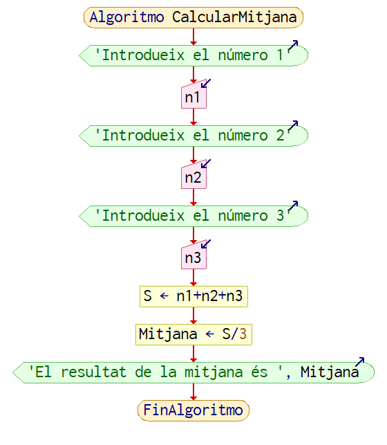

<script type="module">
  import mermaid from 'https://cdn.jsdelivr.net/npm/mermaid@10/dist/mermaid.esm.min.mjs';
  mermaid.initialize({ startOnLoad: true });
</script>

## 1\. Què és la Programació?

La programació és una disciplina fonamental en el món de la informàtica. Es tracta del procés de creació de programes, que són conjunts d’instruccions dissenyades per ser executades per un ordinador per tal de realitzar una tasca específica. En essència, programar significa escriure codis que indiquen a l’ordinador què ha de fer, pas a pas, per resoldre un problema.

### 1.1. Objectiu de la programació

L’objectiu principal de la programació és automatitzar tasques que serien difícils, costoses o impossibles de fer manualment. Alguns exemples són la resolució d’equacions matemàtiques complexes, el processament de grans volums de dades o la simulació de fenòmens físics.

|||
|-|-|
|  | **Exemple:** Suposem que volem calcular el salari total dels empleats d'una empresa. Podríem fer-ho manualment sumant les hores treballades per cada empleat, però si tenim centenars de treballadors, la tasca esdevé massa laboriosa. Un programa pot automatitzar aquest procés, llegint les dades des d'un fitxer i fent els càlculs necessaris en qüestió de segons. |


### 1.2. Diferència entre Programació i altres disciplines

Mentre que altres disciplines científiques o tècniques es dediquen a comprendre i descriure el món, la programació es centra en crear solucions que funcionen en el món digital. Els programes no només descriuen com hauria de funcionar una solució; la fan funcionar.

## 2\. Què és un Algorisme?

Un algorisme és una seqüència finita d'instruccions ben definides que condueixen a la resolució d'un problema o la realització d'una tasca. És important entendre que els algorismes no són exclusius de la informàtica; els fem servir constantment en la nostra vida quotidiana.

### 2.1. Definició formal d’un algorisme

Formalment, un algorisme és un conjunt d'instruccions o passos que descriuen com transformar un conjunt de dades d'entrada en un resultat desitjat. Això es pot aplicar tant a problemes senzills com complexos.

**Exemple:** Imaginem que volem calcular la mitjana de tres números. L'algorisme seria:

1. Sumar els tres números.
2. Dividir la suma pel nombre de números (en aquest cas, 3).
3. El resultat és la mitjana.
 


### 2.2. Característiques dels Algorismes

Perquè un algorisme sigui útil i efectiu, ha de complir amb certes característiques:

* **Concret:** Cada pas de l’algorisme ha de ser clarament definit, sense ambigüitats. Això assegura que qualsevol persona o màquina pugui seguir les instruccions sense confusions.
* **Determinista:** Amb les mateixes dades d'entrada, l'algorisme ha de produir el mateix resultat cada vegada. Això és crucial per a la fiabilitat.
* **Finit:** Un algorisme ha de tenir un nombre finit de passos. No pot continuar indefinidament; ha de conduir a una conclusió.
* **Independent del llenguatge:** Un bon algorisme es pot implementar en qualsevol llenguatge de programació, el que demostra la seva versatilitat.

**Exemple de vida quotidiana:** Algorisme per cuinar un ou dur:


**Procés de cuinar un ou dur**                                                                                                                                                             

```mermaid
flowchart TD
    A[Omplir una olla amb aigua] --> B[Col·locar l'ou a l'olla]
    B --> C[Escalfar l’aigua fins que bulli]
    C --> D[Deixar l'ou bullir durant 10 minuts]
    D --> E[Retirar l'ou de l'aigua i deixar-lo refredar]
``` 

    
### 2.3. Tipus d’Algorismes

Hi ha molts tipus d'algorismes, però els podem agrupar en categories generals segons el tipus de problema que resolen o la manera com ho fan:

* **Algorismes de cerca:** Aquests algorismes s’utilitzen per trobar un element dins d’una col·lecció de dades. Un exemple clàssic és l'algorisme de cerca binària.
* **Algorismes de classificació:** Ordenen un conjunt de dades segons un criteri determinat. L'algorisme de classificació ràpida (quick sort) és un dels més coneguts.
* **Algorismes d'optimització:** Aquests algorismes busquen la millor solució possible per a un problema, sovint intentant minimitzar o maximitzar una funció. Un exemple seria l'algorisme de Dijkstra per trobar el camí més curt en un gràfic.

### 2.4. Algorismes en la Computació

En informàtica, els algorismes són fonamentals perquè determinen l'eficiència d'un programa. Un algorisme mal dissenyat pot provocar que un programa trigui molt de temps a resoldre un problema o, en casos extrems, que no pugui resoldre'l.

**Exemple d'ús d'algorismes en computació:**

* **PageRank de Google:** És un algorisme que determina l'ordre dels resultats en una cerca web, basant-se en la rellevància de les pàgines.
* **NewsFeed de Facebook:** Aquest algorisme selecciona i ordena les notícies i publicacions que veus en el teu feed segons diferents factors com les teves interaccions passades.

## 3\. Què és un Programa?

Un programa és un conjunt d'instruccions escrites en un llenguatge de programació que es tradueixen a un codi executable per un ordinador. El programa és l’implementació d’un algorisme o un conjunt d’algorismes per resoldre problemes específics.

### 3.1. Components d'un Programa

Un programa típic conté les següents parts:

* **Variables:** Espais de memòria on es poden emmagatzemar dades que seran utilitzades pel programa.
* **Instruccions:** Ordres que l’ordinador ha de seguir per processar les dades i obtenir resultats.
* **Funcions:** Blocs de codi que realitzen tasques específiques i que poden ser reutilitzats.

**Exemple:** Un programa senzill en Java que suma dos nombres seria:

```java
// Definició de les variables
int nombre1 = 5;
int nombre2 = 10;

// Suma de les variables
int resultat = nombre1 + nombre2;

// Mostrar el resultat
System.out.println("La suma és: " + resultat);
```

*Il·lustració suggerida*: Una captura de pantalla o un diagrama que mostri el codi Java en un entorn de desenvolupament com Eclipse o IntelliJ IDEA.

### 3.2. De l’Algorisme al Programa

Per crear un programa, primer cal dissenyar un algorisme. Aquest algorisme es tradueix a un llenguatge de programació que l’ordinador pot entendre i executar. Aquesta traducció es coneix com a "codificació" o "implementació".

**Exemple:** Si tenim l'algorisme per calcular la mitjana de tres números, podem implementar-lo en diversos llenguatges de programació com Java, Python, o C++.

## 4\. Llenguatges de Programació

Els llenguatges de programació són sistemes de notació dissenyats per comunicar instruccions a un ordinador. Es poden dividir en diferents categories segons el nivell d’abstracció i la seva finalitat.

### 4.1. Llenguatges de baix nivell

Aquests llenguatges són molt propers al llenguatge màquina, el que significa que les instruccions estan directament relacionades amb el codi binari que l’ordinador entén. Són molt eficients, però difícils d’aprendre i utilitzar.

**Exemple:** L'assemblador és un llenguatge de baix nivell que s’utilitza per programar directament en el hardware.

### 4.2. Llenguatges d'alt nivell

Aquests llenguatges estan dissenyats per ser més comprensibles per als humans. Ofereixen una major abstracció, el que facilita el procés de programació, però a costa d’una mica d’eficiència en comparació amb els llenguatges de baix nivell.

**Exemple:** Java és un llenguatge d'alt nivell que s’utilitza àmpliament per al desenvolupament d'aplicacions empresarials, aplicacions mòbils i sistemes integrats.

*Il·lustració suggerida*: Una comparació visual entre codi en assemblador i codi Java per a una operació simple.

### 4.3. Llenguatges de programació especialitzats

Alguns llenguatges de programació estan dissenyats per a finalitats específiques, com ara la gestió de bases de dades (SQL) o la programació de pàgines web (HTML, CSS, JavaScript).

## 5\. Disseny de la Solució a un Problema

El procés de resolució d’un problema a través de la programació segueix una sèrie de passos que permeten descompondre el problema en parts manejables. Aquests passos inclouen:

### 5.1. Comprensió del problema

El primer pas és entendre bé el problema que es vol resoldre. Això pot implicar llegir detingudament l’enunciat, identificar les dades d’entrada i sortida, i definir clarament què s’espera que faci el programa.

### 5.2. Disseny de l’algorisme

Un cop entès el problema, es procedeix a dissenyar l’algorisme. Aquest pas inclou la descripció detallada dels passos necessaris per arribar a la solució, que pot ser representada amb diagrames de flux, pseudocodi, o fins i tot descripcions textuals.

*Il·lustració suggerida*: Un diagrama de flux que representi el procés de resolució d’un problema, des de la comprensió fins a la codificació.

### 5.3. Codificació

Després de dissenyar l’algorisme, es tradueix a un llenguatge de programació. Aquesta és la fase on es crea el codi font del programa.

### 5.4. Prova i Depuració

Un cop codificat, el programa es prova per assegurar-se que funciona correctament. Això inclou executar el programa amb diferents dades d'entrada per veure si produeix els resultats esperats. Si es troben errors (bugs), es procedeix a la seva depuració.

*Il·lustració suggerida*: Una representació visual del cicle de prova i depuració amb un exemple de codi en Java.

### 5.5. Documentació i Manteniment

Finalment, el codi ha de ser documentat, cosa que implica escriure comentaris i instruccions perquè altres programadors (o el mateix programador en el futur) puguin entendre com funciona el programa. També és important mantenir el programa actualitzat, corregint errors que es puguin trobar amb el temps o afegint noves funcionalitats.

## 6\. Representació d’Algorismes

Per facilitar la comprensió i comunicació dels algorismes, aquests es poden representar gràficament mitjançant diagrames de flux, o textualment amb pseudocodi.

### 6.1. Diagrames de Flux

Els diagrames de flux són una representació visual de l’algorisme, utilitzant símbols normalitzats per indicar diferents tipus d'operacions. És una eina molt útil, especialment en les fases inicials del disseny d’algorismes, perquè permet veure d’un cop d’ull la lògica del programa.

**Exemple de diagrama de flux per un algorisme senzill:**

Imagina un algorisme que calcula si un número és parell o senar. El diagrama de flux tindria els següents passos:

1. Inici
2. Llegir un número
3. Dividir el número per 2
4. Si el residu és 0, el número és parell
5. Si el residu no és 0, el número és senar
6. Final

*Il·lustració suggerida*: Un diagrama de flux amb símbols que mostri aquest procés per determinar si un número és parell o senar.

### 6.2. Pseudocodi

El pseudocodi és una manera d’escriure un algorisme utilitzant una combinació de llenguatge natural i estructures de programació. Encara que no és executable per un ordinador, el pseudocodi serveix com una guia clara per a la codificació.

**Exemple de pseudocodi per un algorisme que calcula la mitjana de tres números:**

```r
Inici
Llegir número1
Llegir número2
Llegir número3
Suma <- número1 + número2 + número3
Mitjana <- Suma / 3
Mostrar Mitjana
Final
```

## 7\. Exemples Pràctics i Activitats

### 7.1. Exemple 1: Càlcul de l'àrea d'un quadrat

**Enunciat:** Dissenyar un algorisme que calculi l'àrea d'un quadrat de costat 4 i el mostri per pantalla.

**Algorisme:**

1. Inici
2. Definir costat <- 4
3. Calcular àrea <- costat \* costat
4. Mostrar àrea
5. Final

**Diagrama de flux:**

1. Inici
2. <math><semantics><mrow><mi>D</mi><mi>e</mi><mi>f</mi><mi>i</mi><mi>n</mi><mi>i</mi><mi>r</mi><mi>c</mi><mi>o</mi><mi>s</mi><mi>t</mi><mi>a</mi><mi>t</mi><mo><</mo><mo>−</mo><mn>4</mn></mrow><annotation>Definir costat <- 4</annotation></semantics></math>Definircostat<−4
3. <math><semantics><mrow><mi>C</mi><mi>a</mi><mi>l</mi><mi>c</mi><mi>u</mi><mi>l</mi><mi>a</mi><mi>r</mi><mover><mi>a</mi><mo>ˋ</mo></mover><mi>r</mi><mi>e</mi><mi>a</mi><mo><</mo><mo>−</mo><mi>c</mi><mi>o</mi><mi>s</mi><mi>t</mi><mi>a</mi><mi>t</mi><mstyle><mtext>\\\*</mtext></mstyle><mi>c</mi><mi>o</mi><mi>s</mi><mi>t</mi><mi>a</mi><mi>t</mi></mrow><annotation>Calcular àrea <- costat \\\* costat</annotation></semantics></math>Calcularaˋrea<−costat\\\*costat
4. <math><semantics><mrow><mi>M</mi><mi>o</mi><mi>s</mi><mi>t</mi><mi>r</mi><mi>a</mi><mi>r</mi><mover><mi>a</mi><mo>ˋ</mo></mover><mi>r</mi><mi>e</mi><mi>a</mi></mrow><annotation>Mostrar àrea</annotation></semantics></math>Mostraraˋrea
5. Final

**Pseudocodi:**

```r
Inici
costat <- 4
àrea <- costat * costat
Mostrar àrea
Final
```

*Il·lustració suggerida*: Un diagrama de flux que representi l’algorisme per calcular l’àrea d’un quadrat.

### 7.2. Exemple 2: Lectura i visualització de dades d’un usuari

**Enunciat:** Dissenyar un algorisme que llegeixi el nom i cognoms d’un usuari i els mostri per pantalla.

**Algorisme:**

1. Inici
2. Llegir nom
3. Llegir cognoms
4. Concatenar nom i cognoms
5. Mostrar el nom complet
6. Final

**Diagrama de flux:**

1. Inici
2. <math><semantics><mrow><mi>L</mi><mi>l</mi><mi>e</mi><mi>g</mi><mi>i</mi><mi>r</mi><mi>n</mi><mi>o</mi><mi>m</mi></mrow><annotation>Llegir nom</annotation></semantics></math>Llegirnom
3. <math><semantics><mrow><mi>L</mi><mi>l</mi><mi>e</mi><mi>g</mi><mi>i</mi><mi>r</mi><mi>c</mi><mi>o</mi><mi>g</mi><mi>n</mi><mi>o</mi><mi>m</mi><mi>s</mi></mrow><annotation>Llegir cognoms</annotation></semantics></math>Llegircognoms
4. <math><semantics><mrow><mi>C</mi><mi>o</mi><mi>n</mi><mi>c</mi><mi>a</mi><mi>t</mi><mi>e</mi><mi>n</mi><mi>a</mi><mi>r</mi><mi>n</mi><mi>o</mi><mi>m</mi><mi>i</mi><mi>c</mi><mi>o</mi><mi>g</mi><mi>n</mi><mi>o</mi><mi>m</mi><mi>s</mi></mrow><annotation>Concatenar nom i cognoms</annotation></semantics></math>Concatenarnomicognoms
5. <math><semantics><mrow><mi>M</mi><mi>o</mi><mi>s</mi><mi>t</mi><mi>r</mi><mi>a</mi><mi>r</mi><mi>n</mi><mi>o</mi><mi>m</mi><mi>c</mi><mi>o</mi><mi>m</mi><mi>p</mi><mi>l</mi><mi>e</mi><mi>t</mi></mrow><annotation>Mostrar nom complet</annotation></semantics></math>Mostrarnomcomplet
6. Final

**Pseudocodi:**

```markdown
Inici
Llegir nom
Llegir cognoms
nom_complet <- nom + " " + cognoms
Mostrar nom_complet
Final
```

*Il·lustració suggerida*: Un diagrama de flux per l’algorisme de lectura i visualització de dades d’un usuari.

## 8\. Conclusió

La programació és una habilitat clau en el món actual, i el disseny d’algorismes és la base sobre la qual es construeix qualsevol programa. Dominar la creació d’algorismes i la seva traducció a codi executable és essencial per a qualsevol persona interessada en la informàtica o l’enginyeria de software. Amb aquesta introducció, els alumnes han de sentir-se preparats per explorar més a fons aquests conceptes i començar a aplicar-los en la resolució de problemes reals.
